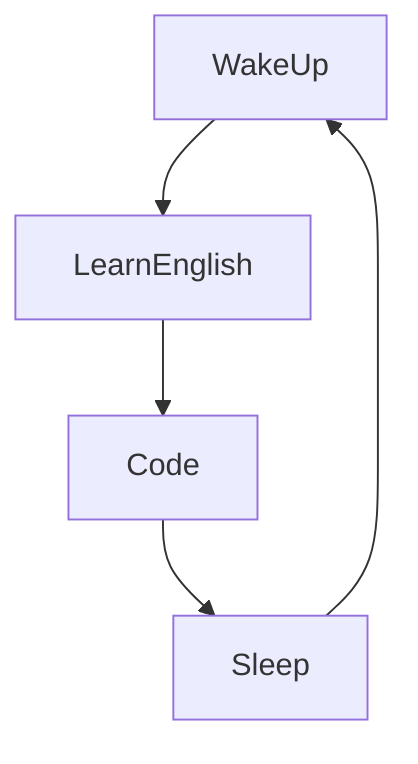

### Sylvain 

I'm Sylvain, a super-passionate Developer from south of France. 😄

I'm a web developer, more specialized in Javascript, Node.js. I'm self-teaching, motivated, I like to put in practice everything I can discover.

Actually : 
- 👀 I'm looking for a new Job in web development.
- 🔭 I’m currently working at TeamWork.
- 🌱 I’m currently learning ReactJS, AWS Services.
- 📫 How to reach me: dev.tess.sylvain@gmail.com or [Linkedin](https://www.linkedin.com/in/tessier-sylvain/)
- ⚡ Fun fact: I'm Diver, traveller and fan of crypto money.
<!--
[//]: # (- 👯 I’m looking to collaborate on ...)
[//]: # (- 🤔 I’m looking for help with )
-->
### Languages and Tools:

 

### My daily routine :

### ⭐ GitHub Stats

### 🔥 Recent GitHub Activity
<!--START_SECTION:activity-->

